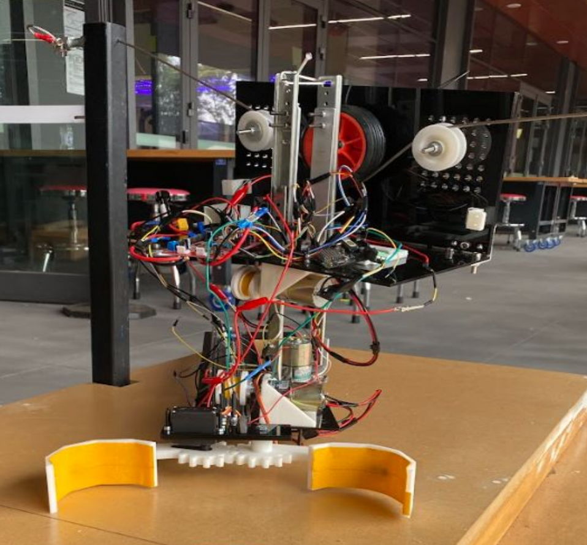
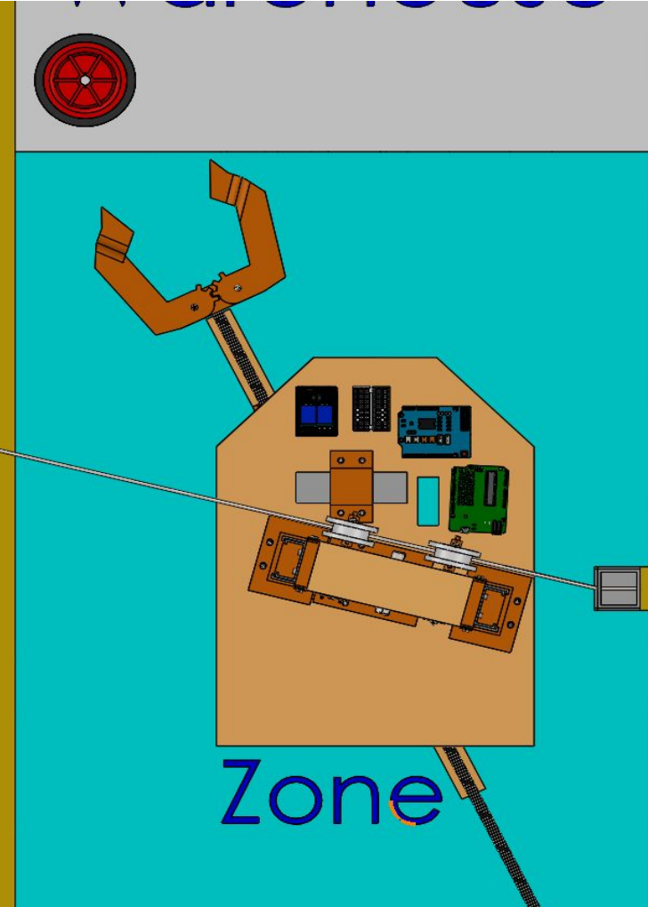
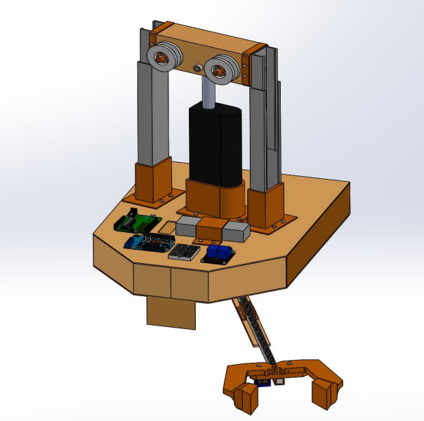
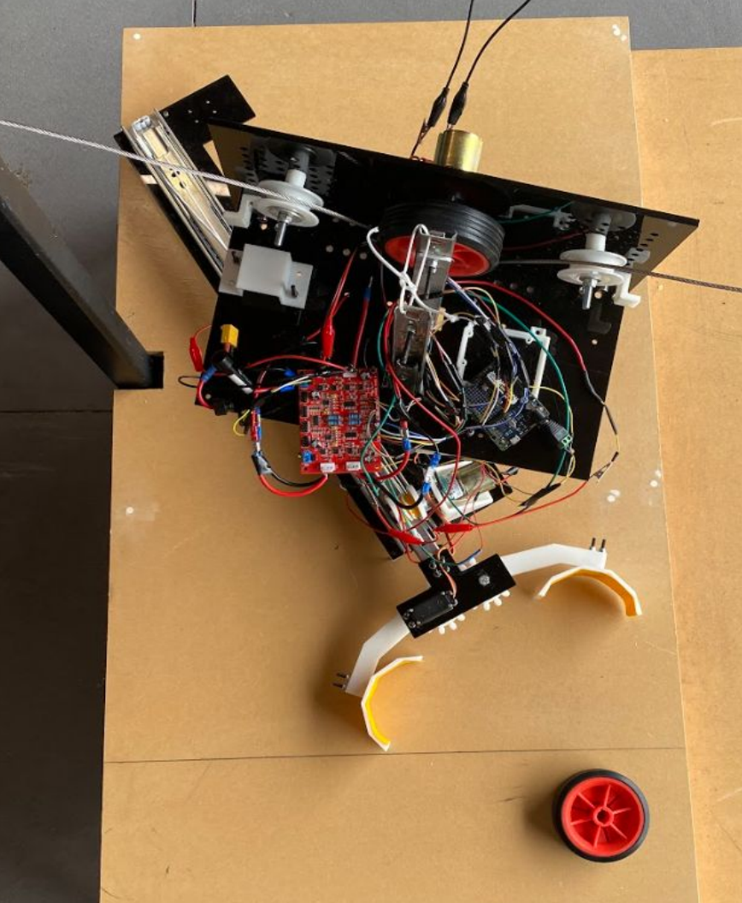
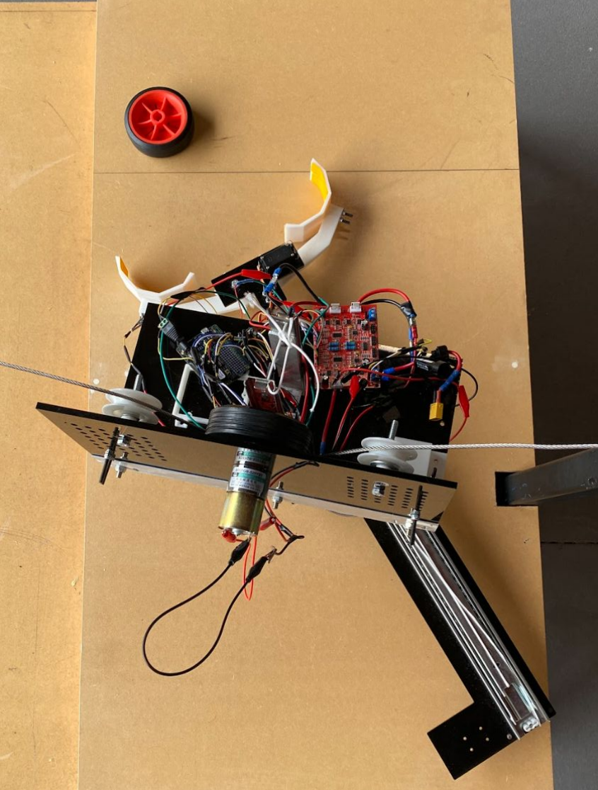
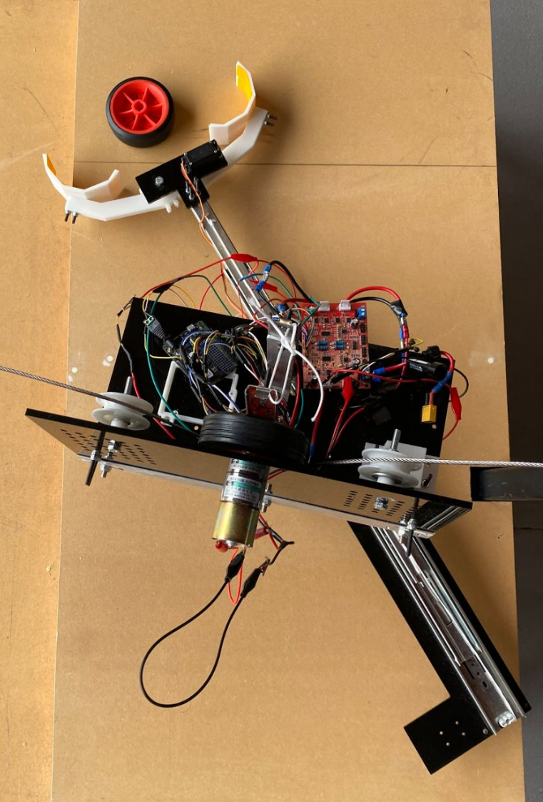
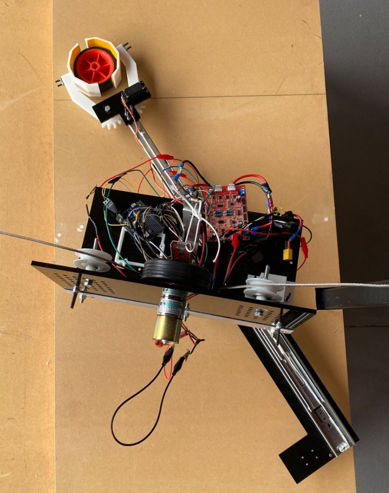

# Warman Design and Build Competition — Autonomous Robot Firmware

Monash University | Robotics and Mechatronics Engineering
Result: 87% task completion, top 10 of 22 competing teams

---



---

## Overview

This repository contains the Arduino firmware for an autonomous robot built for the Warman Design and Build Competition. The robot's task was to pick up a payload from Zone A, transport it to Zone D, release it, and return to the starting position within 120 seconds.

The robot integrates three mechanical subsystems: a gripper, a linear conveyor, and a rotational arm. All three are coordinated by a sensor-driven finite state machine written in C on Arduino. The robot completes the full mission autonomously from the moment the start button is pressed.

Note: the code in this repository was rewritten by me after the competition. The firmware used on competition day was developed collaboratively with the team under time pressure. This version is a clean, structured rewrite that reflects the same logic and hardware behaviour with improved modularity, documentation, and fault handling.

---

## Competition Task



The robot operated on a fixed platform. The task required:

1. Gripping a payload placed at Zone A
2. Transporting it to Zone D via the linear conveyor and rotational arm
3. Releasing the payload at Zone D
4. Returning all axes to the starting position

All steps had to be completed autonomously within 120 seconds from the start signal.

---

## Design



The robot was designed in SolidWorks before fabrication. The chassis uses an acrylic and aluminium frame. The key mechanical feature is a novel rotational mechanism that allows the arm to swing between Zone A and Zone D, reducing linear travel distance and improving cycle time. The conveyor uses a wire rope and pulley system driven by a DC motor to move the carriage along an aluminium linear rail.

---

## Hardware



### Components

- Arduino Mega 2560 microcontroller
- DC motor with L298N H-bridge driver — conveyor linear drive via wire rope and pulleys
- Stepper motor with A4988 or DRV8825 driver — rotational arm mechanism
- Servo motor — gripper open and close
- HC-SR04 ultrasonic sensor — distance feedback
- Limit switches at Zone A and Zone D — end-stop detection via hardware interrupts
- IR sensor — payload presence detection inside gripper
- 3D-printed gripper arms and structural brackets
- Aluminium linear rail extrusion — conveyor carriage track
- Steel wire rope and pulleys — conveyor drive transmission

---

## Payload Pickup Sequence

The three images below show the arm movement from approach to secured grip.







The gripper arms are 3D-printed and driven by a servo motor. The IR sensor inside the gripper confirms payload contact before the state machine advances. If contact is not confirmed after closing, the firmware reopens the gripper and retries rather than continuing with an empty grip.

---

## Firmware Architecture

The firmware is split across 12 files. Each file has one responsibility. All files must be placed in the same Arduino sketch folder to compile correctly.

```
warman_robot/
    warman_robot.ino      Entry point. Contains setup() and loop() only. No logic.
    config.h              All pin definitions, timing constants, and tunable thresholds.
    sensors.h             Public interface for all sensor functions.
    sensors.cpp           Ultrasonic distance, IR payload detection, limit switch ISRs.
    gripper.h             Public interface for gripper control.
    gripper.cpp           Servo motor open and close with settle delays.
    conveyor.h            Public interface for DC motor conveyor.
    conveyor.cpp          L298N direction and PWM control, limit-switch-guided travel.
    arm.h                 Public interface for stepper arm.
    arm.cpp               AccelStepper-based rotational arm with acceleration profiles.
    state_machine.h       Robot state enum and state machine interface.
    state_machine.cpp     Full 9-state mission sequencer with timeout and fault handling.
```

No file exceeds 275 lines.

---

## Module Dependency Map

```
config.h              (no dependencies)
sensors.h / .cpp      --> config.h
gripper.h / .cpp      --> config.h
conveyor.h / .cpp     --> config.h, sensors.h
arm.h / .cpp          --> config.h
state_machine.h/.cpp  --> config.h, sensors.h, gripper.h, conveyor.h, arm.h
warman_robot.ino      --> all modules
```

Dependencies flow in one direction only. No circular includes.

---

## Mission State Machine

```
IDLE
  |-- start button pressed
HOMING
  |-- conveyor at Zone A limit switch, arm at step 0
WAIT_FOR_PAYLOAD
  |-- IR sensor confirms payload (3 consecutive reads)
GRAB
  |-- gripper closed, payload confirmed held
TRANSPORT_TO_D
  |-- conveyor at Zone D limit switch, arm at Zone D steps
DROP
  |-- gripper open, payload release confirmed
RETURN_TO_A
  |-- arm and conveyor back at Zone A
COMPLETE
  |-- LED blinks, elapsed time logged, system holds

Any state --> FAULT on hardware timeout
Any active state --> RETURN_TO_A if mission clock exceeds 110 seconds
```

The abort threshold is 110 seconds, not 120. This reserves 10 seconds for the return journey regardless of where in the sequence the robot is when the clock runs low.

---

## Configuration

All tunable parameters are in config.h. Key values to adjust for your hardware:

```c
ARM_ZONE_D_STEPS       // steps from Zone A to Zone D on the rotational arm
CONV_SPEED_FWD         // PWM speed for conveyor (0-255)
IR_PAYLOAD_THRESHOLD   // analog threshold for IR payload detection
GRIPPER_CLOSED_DEG     // servo angle for closed gripper position
```

Set TEST_MODE to 1 in config.h to enable Serial debug output at 115200 baud. Set to 0 for competition to remove all Serial overhead.

---

## Setup

1. Install required libraries via Arduino Library Manager:
   - AccelStepper by Mike McCauley
   - Servo (built-in to Arduino IDE)

2. Open warman_robot.ino in Arduino IDE. All other files in the folder compile automatically.

3. Select board: Arduino Mega 2560.

4. Update pin numbers in config.h to match your wiring.

5. Set TEST_MODE 1, upload, and open Serial Monitor at 115200 baud to verify each subsystem individually before running a full mission.

6. Set TEST_MODE 0 before final upload for competition day.

---

## Skills Demonstrated

- Embedded firmware development in C on Arduino Mega
- Finite state machine design for autonomous mission sequencing
- Multi-axis actuator coordination across DC motor, stepper motor, and servo
- Hardware interrupt-driven sensor integration
- Modular firmware architecture across 12 files with clean dependency structure
- Real-time fault detection and safe abort handling within a 120-second mission window
- SolidWorks mechanical design and physical prototype integration
- Electronics wiring and subsystem integration across three mechanical assemblies

---

## Team

This was a team project completed by a 4-engineer group at Monash University as part of the Warman Design and Build Competition. My role covered team leadership, electronics wiring, subsystem integration, and firmware development. The firmware in this repository is my own rewrite produced after the competition.
